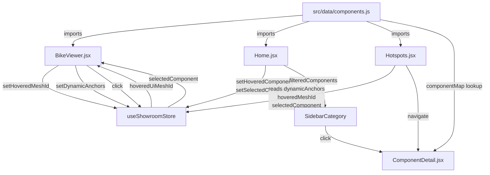

# bikewebV1 — Project Analysis

## 🧩 What This App Is
**Schaeffler 2W Showroom** — an interactive 3D showroom web application that lets users
explore all Schaeffler components fitted on a two-wheeler (motorcycle). It runs as both
a **web app** (Firebase-hosted) and a **standalone Electron desktop app**.

---

## 🛠 Tech Stack

| Layer | Technology |
|---|---|
| UI framework | React 19 (JSX, lazy, Suspense) |
| Routing | React Router v7 (HashRouter) |
| 3D rendering | Three.js v0.183, React Three Fiber v9, Drei v10 |
| Animation | GSAP v3 + @gsap/react |
| State management | Zustand v5 |
| Build tool | Vite v8 |
| Desktop shell | Electron v41 + electron-builder v26 |
| Deployment | Firebase Hosting |
| 3D compression | DRACO (local decoder in `/public/draco/`) |

---

## 📁 Directory Structure

```
bikewebV1/
├── electron/
│   ├── main.cjs          # Electron main process (frameless BrowserWindow)
│   └── preload.cjs       # Context bridge: exposes minimize/maximize/close
├── public/
│   ├── draco/            # Local DRACO WASM decoder — offline capable
│   ├── models/
│   │   ├── Bike_optimized.glb      # Main bike (10 MB, DRACO)
│   │   ├── Bike_draco.glb          # Alternate full-res (21 MB)
│   │   ├── Grops_Bikes1_draco.glb  # Group variant (17 MB)
│   │   ├── Parts/                  # 20+ individual component GLBs
│   │   └── Bike/                   # Sub-parts folder
│   ├── fonts/
│   ├── SchaefflerLogo.png
│   └── mapper.html       # Dev tool for mesh-name inspection
├── src/
│   ├── main.jsx          # Entry: DRACO setup, GLB preload, render root
│   ├── App.jsx           # Routes: / → Home, /component/:id → ComponentDetail
│   ├── index.css         # Global CSS (35 KB — full design system)
│   ├── App.css
│   ├── components/
│   │   ├── BikeViewer.jsx      # Main 3D model + mesh mapping + highlighting
│   │   ├── ComponentViewer.jsx # Per-part 3D viewer with exploded-view logic
│   │   ├── Hotspots.jsx        # 3D-space HTML pins over active component
│   │   ├── InfoPanel.jsx       # Accordion info panel (features/specs/advantages)
│   │   ├── Navbar.jsx          # Logo + Electron window controls
│   │   ├── LoadingScreen.jsx   # Spinner overlay
│   │   ├── RotatePrompt.jsx    # Portrait-mode overlay for mobile
│   │   └── ErrorBoundary.jsx   # GLB load error recovery
│   ├── pages/
│   │   ├── Home.jsx            # Main showroom page (Canvas + sidebar)
│   │   └── ComponentDetail.jsx # Part detail page (viewer + info pane)
│   ├── data/
│   │   └── components.js       # 27 component definitions (id, label, meshes, specs…)
│   ├── store/
│   │   └── useShowroomStore.js # Zustand global state
│   └── utils/
│       ├── resolveAsset.js     # Web vs Electron path resolver
│       ├── meshMapping.js      # Fuzzy GLB mesh-name matching
│       └── loaders.js          # Shared GLTFLoader + DRACOLoader instances
├── vite.config.js         # Build: relative base for Electron, alias deduplication
└── package.json           # Scripts: dev, build, electron:dev, electron:build
```

---

## 🔁 Data & State Flow



### Key State Atoms (Zustand)
| Field | Purpose |
|---|---|
| `selectedComponent` | Currently selected component ID |
| `hoveredComponent` | ID hovered via sidebar list |
| `hoveredMeshId` | ID resolved from 3D mesh pointer events |
| `dynamicAnchors` | `{id: [x, y, z]}` — computed from mesh bounding boxes at runtime |
| `explodeProgress` | 0–1 float driven by `ZoomWatcher` each frame |
| `detailOpen`, `cameraTransitioning` | UI panel / camera state flags |

---

## 📃 Page Architecture

### `Home.jsx` — Main Showroom
- **Left panel**: Sidebar accordion grouped by category (Engine, Transmission, Chassis, EKU)
  - `Electrification` category is **filtered out** here (ICE bike only)
  - Clicking a component sets `selectedComponent` in store
- **Center**: `<Canvas>` (React Three Fiber) — `frameloop="demand"` (renders only on change)
  - `<BikeViewer>` — renders main GLB, handles pointer events
  - `<Hotspots>` — HTML pins in 3D space over the active component
  - `<ZoomWatcher>` — reads camera distance each frame → updates `explodeProgress`
  - `<OrbitControls>` — user rotation/zoom (no pan)
  - `<PerformanceMonitor>` — auto-downgrades DPR on slow devices
- **UX details**:
  - Mobile: reduced DPR (1.0), wider FOV, no HW antialiasing
  - `<RotatePrompt>` for portrait phones
  - `<LoadingOverlay>` driven by `useProgress()` from Drei

### `ComponentDetail.jsx` — Part Detail Page
- Split layout: **3D viewer pane** | **scrollable info pane**
- 3D viewer: `<ComponentViewer>` — separate `<Canvas>` with OrbitControls, Bounds auto-fit
- Info pane: `<InfoPanel>` with GSAP stagger animation on mount
- Scroll position of info pane → `scrollProgress` → drives explosion in 3D viewer
- GSAP fade-in on page enter (`opacity: 0 → 1`)

---

## 🧱 Component Architecture

### `BikeViewer.jsx` — Core Complexity

**Phase 1: Setup (useEffect on scene load)**
1. Computes bounding box → bike center for explode directions
2. Iterates all meshes → stores `userData.origPos` and `userData.explodeDir`
3. For each component in `components.js` (excluding Electrification):
   - Calls `isMeshMatch()` against each mesh + parent groups
   - Assigns `child.userData.componentId`
   - Builds `meshesByComponentRef` lookup
   - Accumulates bounding box → computes dynamic anchor → pushes to store

**Phase 2: Per-frame (useFrame)**
- Explode animation is **commented out** — feature shelved

**Phase 3: Highlighting (useEffect on hover/selection state)**
- Reads `hoveredUiMeshId || selectedComponent`
- Uses `meshesByComponentRef` for O(k) lookup (avoids O(n) traversal every hover)
- `applyEmissive()` + `clearAllHighlights()` — lazy material cloning (clones only on first highlight)
- Schaeffler green `#00893D` emissive + color override

**Phase 4: Pointer events**
- `handlePointerOver` → `setHoveredMeshId(compId)`
- `handlePointerOut` → `setHoveredMeshId(null)`
- `handleClick` → `setSelectedComponent(compId)` (no navigation — user navigates via hotspot)
- DEV mode: `Ctrl+Click` logs exact mesh name

### `ComponentViewer.jsx` — Exploded View Engine
- **Smart axis detection**: finds the "bore axis" = thinnest bounding-box dimension (reliable for bearings/clutches) with fallback to centroid-spread variance for non-cylindrical shapes
- Classifies meshes as **concentric** (rings, cage shell) vs **radial** (rollers, balls)
- Concentric meshes spread along primary axis (outer → positive, inner → negative)
- Radial meshes push outward from the shaft axis
- `explodeTrigger`:
  - `'scroll'` — driven by info pane scroll position
  - `'zoom'` — driven by camera zoom distance (`initialDistRef` calibration)
- Uses module-level scratch `Vector3` (`_tempW`, `_tempL`) to avoid GC pressure

### `meshMapping.js` — Fuzzy Mesh Matching
- `getBaseName()` — strips GLTF suffixes (`_primitive0`, `_mesh`, `_node`, `__N`)
- `cleanString()` — removes all non-alphanumeric chars, lowercases
- `isMeshMatch()` — checks:
  1. Exact cleaned match
  2. Mesh name contains target substring
  3. Target contains mesh base name (reverse inclusion)
- Also checks parent group names up the scene hierarchy

### `resolveAsset.js` — Dual-Context Path Resolution
- `file://` protocol → Electron production → strip leading `/`, prefix `./`
- `http/https` → dev server or web → use absolute path as-is

---

## 🗂 Data Layer — `components.js`

**27 components** across 5 categories:

| Category | Count | Notes |
|---|---|---|
| Engine Control Units | 3 | M4C, M4A/B, M4REK |
| Engine | 9 | Injector, Knock Sensor, Pressure Sensor, Flex Fuel, Chain Tensioner, Cam Roller, Crankpin, One Way Clutch, Drawn Cup (Starter), Cylindrical Roller |
| Transmission | 3 | Plastic Cage Needle, Machined Needle RNA/NK, Deep Groove Ball |
| Chassis | 5 | Drawn Cup (Swing Arm), Ball+ABS, Angular Contact, Steering TRB |
| Electrification | 4 | E-Motor, eDCU, iRPS, BMS — **filtered out** from ICE bike view |

Each component has:
- `id`, `label`, `category`, `model`, `anchor` (3D position)
- `targetMeshes[]` — strings matched against GLB mesh names
- `tagline`, `highlights[]`, `features[]`, `advantages[]`, `specs{}`
- Optional: `hasExplodedView`, `explodeTrigger`

---

## 🖥 Electron Integration

| Feature | Implementation |
|---|---|
| Frameless window | `frame: false` in `BrowserWindow` |
| Custom title bar | `<Navbar>` renders minimize/maximize/close only when `window.electronAPI` exists |
| Context isolation | `contextIsolation: true`, `nodeIntegration: false` |
| IPC bridge | `preload.cjs` exposes `window.electronAPI.minimize/maximize/close` via `contextBridge` |
| Dev mode | Loads `http://localhost:5173`, opens DevTools detached |
| Prod mode | Loads `dist/index.html` (file:// protocol) |
| Asset resolution | `resolveAsset()` handles file:// → relative paths |
| Build targets | `portable` + `zip` on Windows |

---

## ⚡ Performance Strategies

| Strategy | Where |
|---|---|
| `frameloop="demand"` | Canvas only renders on invalidation — zero idle CPU |
| `useGLTF.preload()` at module init | Bike GLB fetched before React mounts |
| Local DRACO decoder | No CDN — fully offline, fast |
| `Bvh` (BVH acceleration) | Wraps the scene for faster raycasting |
| `PerformanceMonitor` | Auto-reduces DPR on performance decline |
| Lazy material cloning | `ensureOwnMaterial()` clones only on first highlight |
| O(k) highlight lookup | `meshesByComponentRef` map built once at load |
| `meshesByComponentRef` | Avoids O(n) `scene.traverse()` on every hover |
| Demand invalidation | `invalidate()` called only after state changes |
| Module-level scratch vectors | `_tempW`, `_tempL` in ComponentViewer avoid GC |
| Mobile DPR cap | `isMobileDevice` → DPR 1.0, no HW MSAA |
| Quantized explode progress | `ZoomWatcher` quantizes to 0.005 steps — limits store writes |

---

## ⚠️ Known Issues & Observations

> [!WARNING]
> **Explode feature is disabled on the Home page.** `useFrame()` in `BikeViewer` wraps the entire explode logic in a block comment. `ZoomWatcher` still computes and writes `explodeProgress` to the store, but nothing reads it on the main bike. This is dead code that should either be removed or re-enabled.

> [!WARNING]
> **`drawn_cup_starter` and `drawn_cup_swing` share the same anchor** `[-0.068, -2.086, -0.710]` — they are different components with the same hardcoded anchor. Since hotspots are now 100% dynamic-anchor based, this only matters if a mapping fails.

> [!NOTE]
> **Electrification components** (E-Motor, eDCU, iRPS, BMS) have no `targetMeshes` and no matching GLBs in `public/models/Parts/`. They reference `e_motor.glb`, `edcu.glb`, etc. at the root of `public/models/` — these are for the separate `schafflerBikeV2` EV project. On this ICE bike project they are **silently skipped** via the `filteredComponents` filter.

> [!NOTE]
> **`Navbar.jsx` uses a hardcoded relative path** `./SchaefflerLogo.png` instead of `resolveAsset()`. This may break in some Electron configurations depending on the working directory.

> [!NOTE]
> **Commented-out DEV logging** — there are many `console.log` statements commented out throughout `BikeViewer.jsx` with inline comments indicating they were used during mesh calibration. These are harmless but add noise.

> [!NOTE]
> **`loaders.js`** is defined but appears unused in the current React component code — all components use `useGLTF` from Drei (which internally uses its own loader). `loaders.js` would be needed for imperative raw Three.js loading outside R3F.

---

## 🔮 Improvement Opportunities

| Area | Suggestion |
|---|---|
| **Dead code** | Remove the commented-out explode block in `BikeViewer.useFrame()` or re-enable it |
| **Electrification** | Either remove EV entries from components.js (they're unused on this project) or add a clear comment block explaining they exist for bikewebV2 |
| **Asset path** | Replace `./SchaefflerLogo.png` in Navbar with `resolveAsset('/SchaefflerLogo.png')` |
| **Shared anchor** | Fix duplicate anchor coordinates for `drawn_cup_starter` vs `drawn_cup_swing` |
| **loaders.js** | Either use it or delete it to reduce confusion |
| **ZoomWatcher** | Since explode is disabled, either disable ZoomWatcher or wire it to something |
| **Mobile experience** | `RotatePrompt` exists but landscape-lock isn't enforced — consider explicit landscape hint UX |
| **Component count** | Sidebar shows `filteredComponents.length` = 23 (excluding EV 4), but total in file is 27 |
| **SEO** | `index.html` has no meaningful `<meta description>` or structured data |
| **Accessibility** | Hotspot pins and 3D interaction have no keyboard navigation or ARIA roles |
